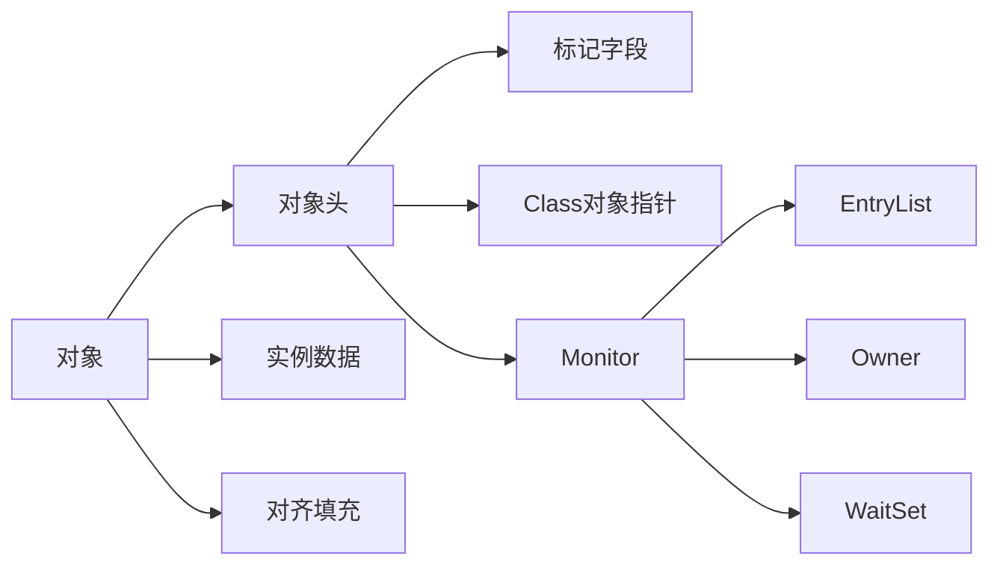
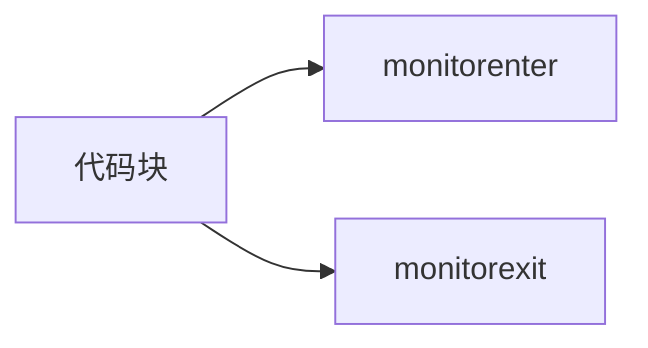
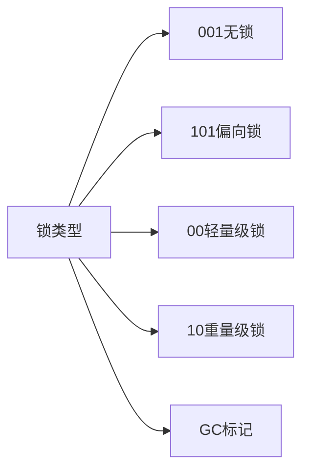

## 1.jvm回收多少次新生代会转到老年代

*   \-XX\:MaxTenuringThreshold=15

*   15次,jvm有一个规定，对象在新生代如果连续躲过15次垃圾回收，那么这个对象就会从新生代进入老年代

    躲过15次GC之后进入老年代,I可通过JVM参数"-XX\:MaxTenuring Threshold" 来设置年龄，默认为15岁

## 2.数据结构，HashCode为什么使用31作为乘数

*   [x] 来自《Effective Java》的回答

*   31 是一个奇质数，如果选择偶数会导致乘积运算时数据溢出。

*   另外在二进制中，2个5次方是32，那么也就是 `31 * i == (i << 5) - i`。这主要是说乘积运算可以使用位移提升性能，同时目前的JVM虚拟机也会自动支持此类的优化。

*   [x] 来自stackoverflow的回答

*   用超过5万个单词计算hashCode，这个hashCode的运算使用31、33、37、39和41作为乘积，得到的碰撞结果，31被使用就很正常了。

## 3. HashMap为什么使用扰动函数

```java
static final int hash(Object key) {
    int h;
    return (key == null) ? 0 : (h = key.hashCode()) ^ (h >>> 16);
}
```

理论上来说字符串的`hashCode`是一个int类型值，那可以直接作为数组下标了，且不会出现碰撞。但是这个`hashCode`的取值范围是\[-2147483648, 2147483647]，有将近40亿的长度，谁也不能把数组初始化的这么大，内存也是放不下的。

我们默认初始化的Map大小是16个长度 `DEFAULT_INITIAL_CAPACITY = 1 << 4`，所以获取的Hash值并不能直接作为下标使用，需要与数组长度进行取模运算得到一个下标值。

那么，hashMap源码这里不只是直接获取哈希值，还进行了一次扰动计算，`(h = key.hashCode()) ^ (h >>> 16)`。把哈希值右移16位，也就正好是自己长度的一半，之后与原哈希值做异或运算，这样就混合了原哈希值中的高位和低位，增大了**随机性.**

## 4.ThreadLocal 会发生内存泄漏吗?

**如果使用不当是有可能发生内存泄露的.**

注: 使用完ThreadLocal都需要调用它的remove()方法清除数据。因为它的remove方法会主动将当前的key和value(Entry)进行清除.

**弱引用**一般是用来描述非必需对象的，被弱引用关联的对象只能生存到下一次垃圾收集发生之前。**当垃圾收集器工作时，无论当前内存是否足够，都会回收掉只被弱引用关联的对象.**

```java
public class Thread implements Runnable {
    //属于这个线程的ThreadLocal值。这个映射由ThreadLocal类维护。
	ThreadLocal.ThreadLocalMap threadLocals = null;
}
```

ThreadLocal真正的值存在Entry中,若在线程池中，则引用关系为：\
threadpool -> thread -> threadLocalMap -> entry -> value -> v(实际的值，强引用)

```java
public class ThreadLocal<T> {

    static class ThreadLocalMap {

        static class Entry extends WeakReference<ThreadLocal<?>> {
            /** The value associated with this ThreadLocal. */
            Object value;

            Entry(ThreadLocal<?> k, Object v) {
                super(k);
                value = v;
            }				
        }

		 private void set(ThreadLocal<?> key, Object value) {
    		Entry[] tab = table;
    		int len = tab.length;
    		int i = key.threadLocalHashCode & (len-1);
    		for (Entry e = tab[i]; e != null; e = tab[i = nextIndex(i, len)]) {
        		ThreadLocal<?> k = e.get();
        		if (k == key) {
            		e.value = value;
            		return;
        		}
        		if (k == null) {
            		replaceStaleEntry(key, value, i);
            		return;
        		}
    		}
    		tab[i] = new Entry(key, value);
    		int sz = ++size;
    		if (!cleanSomeSlots(i, sz) && sz >= threshold) {
				    rehash();	
			   }

    }
	
    public void set(T value) {
        Thread t = Thread.currentThread();
        ThreadLocalMap map = getMap(t);
        if (map != null)
            map.set(this, value);
        else
            createMap(t, value);
    }

    public T get() {
        Thread t = Thread.currentThread();
        ThreadLocalMap map = getMap(t);
        if (map != null) {
            ThreadLocalMap.Entry e = map.getEntry(this);
            if (e != null) {
                @SuppressWarnings("unchecked")
                T result = (T)e.value;
                return result;
            }
        }
        return setInitialValue();
    }

    private void remove(ThreadLocal<?> key) {
        Entry[] tab = table;
        int len = tab.length;
        int i = key.threadLocalHashCode & (len-1);
        for (Entry e = tab[i]; e != null; e = tab[i = nextIndex(i, len)]) {
            if (e.get() == key) {
                e.clear(); // 清除key
                expungeStaleEntry(i);  // 清除value
                return;
            }    
        }
    }


}		
```

## 5.对象在内存中的存储布局

*   对象头

    *   标记字段MarkWord: 记录了对象的哈希码,GC分代年龄,锁标志位等信息.
    *   类型指针,即对象指向它的类型元数据指针，如果对象是一个Java数组，那在对象头中还必须有一块用于记录数组长度的数据（4个字节）.
    *   在32位系统下，类型指针大小是4字节，MarkWord是4字节，对象头为8字节。 在64位系统下，类型指针大小是8字节，MarkWord是8字节，对象头为16字节。 在64位开启指针压缩的情况下 -XX:+UseCompressedOops，类型指针大小是4字节，MarkWord是8字节，对象头为12字节。 如果对象是数组，那么额外增加4个字节.
*   实例数据
*   对齐填充

    *   占位填充的，由于虚拟机要求对象大小时8byte的整数倍

## 6.volatile的作用

*    volatile 会控制被修饰的变量在内存操作上主动把值刷新到主内存，JMM 会把该线程对应的CPU内存设置过期，从主内存中读取最新值.
*   那么，volatile 如何防止指令重排也是内存屏障，volatile 的内存屏故障是在读写操作的前后各添加一个 StoreStore屏障，也就是四个位置，来保证重排序时不能把内存屏障后面的指令重排序到内存屏障之前的位置.

## 7.synchronized关键字 [link](https://bugstack.cn/md/java/interview/2020-10-28-%E9%9D%A2%E7%BB%8F%E6%89%8B%E5%86%8C%20%C2%B7%20%E7%AC%AC15%E7%AF%87%E3%80%8A%E7%A0%81%E5%86%9C%E4%BC%9A%E9%94%81%EF%BC%8Csynchronized%20%E8%A7%A3%E6%AF%92%EF%BC%8C%E5%89%96%E6%9E%90%E6%BA%90%E7%A0%81%E6%B7%B1%E5%BA%A6%E5%88%86%E6%9E%90%EF%BC%81%E3%80%8B.html)

特性:&#x20;

*   原子性 (单一线程持有)
*   可见性 (内存强制刷新)
    *   **为什么 synchronized 能保证变量的可见性**

        a.线程解锁前，必须把共享变量的最新值刷新到主内存中。

        b.线程加锁前，将清空工作内存中共享变量的值，从而使用共享变量时需要从主内存中重新读取最新的值。

        c.volatile 的可见性都是通过内存屏障（Memnory Barrier）来实现的。

        d.synchronized 靠操作系统内核互斥锁实现，相当于 JMM 中的 lock、unlock。退出代码块时刷新变量到主内存。
*   有序性 (as-if-serial , happen-before)
*   可重入性
    > #### 锁会降级吗？`Biased lock revocation`，当 JVM 进入安全点 [SafePoint (opens new window)](http://blog.ragozin.info/2012/10/safepoints-in-hotspot-jvm.html)的时候，会检查是否有闲置的 Monitor，然后试图进行降级。







**HotSpot虚拟机中**，对象在内存中存储的布局可以分为三块区域：`对象头（Header）`、`实例数据（Instance Data）`和`对齐填充（Padding）`。

*   mark-word：对象标记字段占8个字节，用于存储一些列的标记位，比如：哈希值、轻量级锁的标记位，偏向锁标记位、分代年龄等。
*   Klass Pointer：Class对象的类型指针，Jdk1.8默认开启指针压缩后为4字节，关闭指针压缩（`-XX:-UseCompressedOops`）后，长度为8字节。其指向的位置是对象对应的Class对象（其对应的元数据对象）的内存地址。
*   对象实际数据：包括对象的所有成员变量，大小由各个成员变量决定，比如：byte占1个字节8比特位、int占4个字节32比特位。
*   对齐：最后这段空间补全并非必须，仅仅为了起到占位符的作用。由于HotSpot虚拟机的内存管理系统要求对象起始地址必须是8字节的整数倍，所以对象头正好是8字节的倍数。因此当对象实例数据部分没有对齐的话，就需要通过对齐填充来补全。

**另外**，在mark-word锁类型标记中，无锁，偏向锁，轻量锁，重量锁，以及GC标记，5种类中没法用2比特标记（2比特最终有4种组合`00`、`01`、`10`、`11`），所以无锁、偏向锁，前又占了一位偏向锁标记。最终：001为无锁、101为偏向锁.

## 8.mysql事务

**数据库事务的四大特性：**

1、**原子性**：事务包含的所有数据库操作要么全部成功，要不全部失败回滚

2、**一致性**：一个事务执行之前和执行之后都必须处于一致性状态。拿转账来说，假设用户A和用户B两者的钱加起来一共是5000，那么不管A和B之间如何转账，转几次账，事务结束后两个用户的钱相加起来应该还得是5000，这就是事务的一致性。

3、**隔离性**：一个事务未提交的业务结果是否对于其它事务可见。级别一般有：**read\_uncommit，read\_commit，read\_repeatable，Serializable 串行化访问**。

4、**持久性**：一个事务一旦被提交了，那么对数据库中数据的改变就是永久性的，即便是在数据库系统遇到故障的情况下也不会丢失提交事务的操作。

为了达到事务的四大特性，数据库定义了4 种不同的事务隔离级别:

*   **READ-UNCOMMITTED(读取未提交)**: 最低的隔离级别，允许脏读，也就是可能读取到其他会话中未提交事务修改的数据，可能会导致脏读、幻读或不可重复读。
*   **READ-COMMITTED(读取已提交)**: 只能读取到已经提交的数据。Oracle 等多数数据库默认都是该级别(不重复读)，可以阻止脏读，但是幻读或不可重复读仍有可能发生。&#x20;
*   **REPEATABLE-READ(可重复读)**: 对同一字段的多次读取结果都是一致的，除非数据是被本身事务自己所修改，可以阻止脏读和不可重复读，但幻读仍有可能发生。&#x20;
*   **SERIALIZABLE(可串行化)**: 最高的隔离级别，完全服从ACID的隔离级别。所有的事务依次逐个执行，这样事务之间就完全不可能产生干扰，也就是说，该级别可以防止脏读、不可重复读以及幻读。
*   &#x20;MySQL 默认采用的 REPEATABLE\_READ 隔离级别

**(1) 脏读（读取未提交数据）**

A事务读取B事务尚未提交的数据，此时如果B事务发生错误并执行回滚操作，那么A事务读取到的数据就是脏数据。就好像原本的数据比较干净、纯粹，此时由于B事务更改了它，这个数据变得不再纯粹。这个时候A事务立即读取了这个脏数据，但事务B良心发现，又用回滚把数据恢复成原来干净、纯粹的样子，而事务A却什么都不知道，最终结果就是事务A读取了此次的脏数据，称为脏读。

**(2) 不可重复读（前后多次读取，数据内容不一致）**

事务A在执行读取操作，由整个事务A比较大，前后读取同一条数据需要经历很长的时间 。而在事务A第一次读取数据，比如此时读取了小明的年龄为20岁，事务B执行更改操作，将小明的年龄更改为30岁，此时事务A第二次读取到小明的年龄时，发现其年龄是30岁，和之前的数据不一样了，也就是数据不重复了，系统不可以读取到重复的数据，成为不可重复读。

**(3) 幻读（前后多次读取，数据总量不一致）**

事务A在执行读取操作，需要两次统计数据的总量，前一次查询数据总量后，此时事务B执行了新增数据的操作并提交后，这个时候事务A读取的数据总量和之前统计的不一样，就像产生了幻觉一样，平白无故的多了几条数据，成为幻读。

**不可重复读和幻读到底有什么区别呢？**

(1) 不可重复读是读取了其他事务更改的数据，**针对update操作**

解决：使用行级锁，锁定该行，事务A多次读取操作完成后才释放该锁，这个时候才允许其他事务更改刚才的数据。

(2) 幻读是读取了其他事务新增的数据，**针对insert和delete操作**

解决：使用表级锁，锁定整张表，事务A多次读取数据总量之后才释放该锁，这个时候才允许其他事务新增数据。

## 9.MySQL 为什么 InnoDB 是默认引擎?

MyISAM    \[maɪ-zeim]

InnoDB	   \['ɪnnə-db]

MySQL 有两种常见的存储引擎。一种是 MyISAM，一种是 InnoDB.

## 10.jdk1.7与1.8的区别

*   Lambada表达式
*   Stream流API
*   接口中可以写默认方法
*   JVM移除永久代，引入元空间
*   等等

## 11.对象头上有什么东西？

*   非数组对象，对象头包括Mark Word(标记字段)和类型指针。
*   数组对象，对象头包括Mark Word(标记字段)和Class Pointer(类型指针)及数组的长度。

## 12.32位的机器和64位的机器 Mark Word有什么区别

*   标记字段的占用空间大小在 HotSpot 虚拟机中为 32 位 JVM 上占用 32 个 bit（4 个字节）；
*   64 位 JVM 上占用 64 个 bit（8 个字节），需要注意的是，不同的虚拟机实现可能会有所不同。

## 13.缓存弱一次性和强一次性 mesi协议，竞争条件解决方案有哪些

## 14.AQS两个核心思想: CPU处理资源的调度 对竞争资源的控制

*   Java中的AQS（AbstractQueuedSynchronizer）是一种实现同步器的抽象框架，它的核心思想是基于FIFO队列的等待/通知机制。该机制通过内部维护一个FIFO双向队列来管理线程的竞争和等待，并且采用CAS操作等原子性保证手段来确保线程之间状态的正确转换。
*   具体地说，当多个线程竞争同步资源时，如果某个线程获取不到锁，则会被加入到等待队列中，等待队列中的线程按照FIFO顺序进行排队，并且只有队首的线程才能尝试获取锁或者执行特定的操作；当锁释放时，除了唤醒队首节点对应的线程外，还会唤醒后继节点直到遇到被标记为可以执行的节点为止，这个过程就是线程之间的等待/通知机制。

&#x20;     AQS的核心思想可以扩展到多种同步器的实现中，如ReentrantLock、CountDownLatch、Semaphore等，是Java多线程编程中非常重要的基础框架。

&#x20;     偏向锁 对象头的Mark Word会设置为偏向锁

juc里面的锁有两种实现 读写锁和locklock可以被中断 syn没抢占到锁只能被阻塞

## 15.jvm内存管理应该从三个角度去描述:哪些内存可以被回收 通过什么方式去回收 哪个时间点去回收 stw

## 16.类加载是什么时候被触发的

## 17.操作系统分段和分页的概念

## 18.分页模式 页宽 端口映射

## 19.TCP/IP协议分4层&#x20;

*   应用层
*   传输层&#x20;
*   网络层
*   网络接口层&#x20;

    ### 19.1 OSI七层协议

    *   应用层
    *   表示层
    *   会话层
    *   传输层
    *   网络层
    *   数据链路层
    *   物理层

    ### 19.2 五层协议

    *   应用层
    *   运输层
    *   网络层
    *   数据链路层
    *   物理层

## 20.你如何判断网络是不是通的 tcp的工具git有几种对象 回滚代码的时候

## 21.Maven 私服有几种类型 快照的概念和稳定版本的概念

## 22.零拷贝

零拷贝（Zero-copy）是一种可以减少CPU拷贝操作，提高系统性能的技术。在传统的数据传输过程中，数据需要在用户空间和内核空间之间进行多次拷贝，这会消耗大量的CPU资源。零拷贝技术通过减少或消除这些拷贝操作，可以降低CPU的使用率，提高数据传输的效率。

零拷贝的实现方式主要有以下几种：

- MMAP + WRITE：使用mmap系统调用将文件映射到内存，然后使用write系统调用将数据写入到目标文件。这种方式可以避免在用户空间和内核空间之间进行拷贝，但仍然需要在内核空间进行一次拷贝。

- SEND_FILE：sendfile系统调用可以直接将数据从一个文件描述符传输到另一个文件描述符，完全在内核空间进行，无需在用户空间和内核空间之间进行拷贝。

- SPLICE：splice系统调用可以将数据从一个文件描述符移动到另一个文件描述符，无需进行任何拷贝。

- DMA：直接内存访问（Direct Memory Access）是一种可以让硬件设备直接访问内存的技术，无需通过CPU。

零拷贝技术被广泛应用在各种系统中，例如**网络传输（如TCP/IP协议栈）**，**文件系统**，**数据库**，**消息队列**(如Kafka)等。这些系统通过使用零拷贝技术，可以大大提高数据传输的效率，降低系统的CPU使用率。

### 网络数据传输示例：

在传统的网络数据传输过程中，数据需要在用户空间和内核空间之间进行多次拷贝，这会消耗大量的CPU资源。零拷贝技术通过减少或消除这些拷贝操作，可以降低CPU的使用率，提高数据传输的效率。

以下是一个传统的网络数据传输过程：

1. 应用程序从磁盘读取数据到用户空间的缓冲区（第一次拷贝）。
2. 应用程序将数据从用户空间的缓冲区写入到内核空间的socket缓冲区（第二次拷贝）。
3. 网络协议栈将数据从socket缓冲区发送到网络。

在这个过程中，数据需要在用户空间和内核空间之间进行两次拷贝，这会消耗大量的CPU资源。

零拷贝技术可以通过以下方式来提高网络传输的性能：

1. **MMAP + WRITE**：使用mmap系统调用将文件映射到内存，然后使用write系统调用将数据写入到socket。这种方式可以避免在用户空间和内核空间之间进行拷贝，但仍然需要在内核空间进行一次拷贝。

2. **SEND_FILE**：sendfile系统调用可以直接将数据从文件描述符传输到socket，完全在内核空间进行，无需在用户空间和内核空间之间进行拷贝。

3. **SPLICE**：splice系统调用可以将数据从一个文件描述符移动到socket，无需进行任何拷贝。

这些零拷贝技术可以大大降低CPU的使用率，提高数据传输的效率，从而提高网络传输的性能。